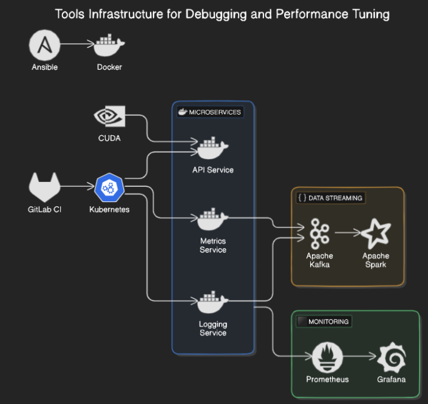
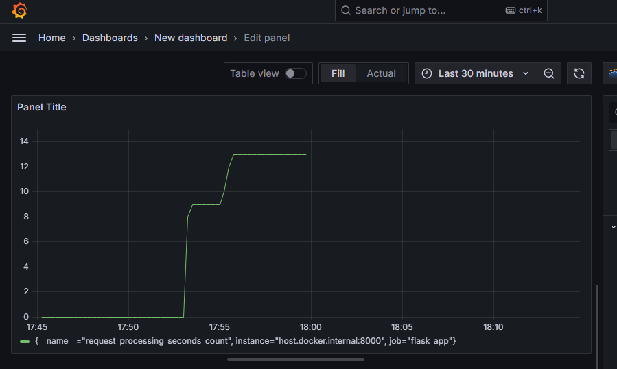

# Tools Infrastructure for Debugging and Performance Tuning

### **Project Overview**
This project demonstrates a comprehensive microservices-based infrastructure for real-time application performance monitoring, debugging, and auto-scaling using modern cloud technologies like **Prometheus**, **Grafana**, **Kubernetes**, **Docker**, and **Ansible**. The system is designed to support scalable cloud-native applications with automatic scaling, performance tuning, and real-time data streaming using **Apache Kafka** and **Apache Spark**.

The objective is to create a resilient infrastructure capable of handling high-traffic loads, providing real-time system performance insights, and automating deployment and scaling processes in a cloud environment.

---

### **Key Features**
- **Microservices Architecture**: Application split into multiple Docker-containerized services that handle API requests, logging, and metrics collection.
- **Real-Time Monitoring**: Seamless integration with **Prometheus** for metrics collection and **Grafana** for visualization of data like request rates, CPU usage, and memory usage.
- **Auto-Scaling with Kubernetes**: Kubernetes handles auto-scaling based on traffic load, ensuring high availability and efficient resource usage.
- **Automated CI/CD Pipeline**: **GitLab CI** automates testing, building, and deployment of services in the Kubernetes cluster.
- **Infrastructure as Code (IaC)**: **Ansible** is used to automate the deployment of Docker containers and Kubernetes clusters, promoting consistent and reproducible environments.
- **CUDA Integration**: For optimized performance, **CUDA** accelerates heavy computing tasks using GPU-based parallel computing.
- **Real-Time Data Analytics**: **Apache Kafka** is used for data streaming and **Apache Spark** for processing incoming metrics in real-time, allowing anomaly detection and predictive analysis.

---

### **Architecture**


---

### **Grafana Dashboard Example**
Below is an example of the real-time data visualization in **Grafana** that tracks the `request_processing_seconds_count` for the API service:



---

### **Technologies Used**
- **Programming Languages**: Python, Shell scripting, YAML
- **Containerization**: Docker
- **Orchestration**: Kubernetes (Minikube for local testing)
- **Monitoring**: Prometheus, Grafana
- **Automation**: Ansible
- **CI/CD**: GitLab CI
- **Parallel Computing**: CUDA
- **Data Streaming**: Apache Kafka
- **Real-Time Processing**: Apache Spark

---

### **Getting Started**

#### **Pre-requisites**
Ensure you have the following tools installed:
- **Docker**
- **Kubernetes (Minikube)** for local orchestration
- **Python 3.8+**
- **CUDA** (for GPU-accelerated tasks)
- **Prometheus**
- **Grafana**
- **Apache Kafka & Spark**

#### **1. Clone the Repository**
```bash
git clone https://github.com/yourusername/tools-infra-performance.git
cd tools-infra-performance
```

#### **2. Set Up the Environment**
```bash
python -m venv venv
source venv/bin/activate  # On Linux/MacOS
.env\Scriptsctivate   # On Windows
pip install -r requirements.txt
```

#### **3. Build Docker Images**
Each service has its own Dockerfile. Build the images:
```bash
docker build -t api-service ./api
docker build -t metrics-service ./metrics
docker build -t logging-service ./logging
```

#### **4. Deploy Using Kubernetes**
```bash
kubectl apply -f api-service.yaml
kubectl apply -f metrics-service.yaml
kubectl apply -f logging-service.yaml
```

#### **5. Launch Prometheus and Grafana**
1. **Prometheus**:
```bash
docker run -d -p 9090:9090 -v /path/to/prometheus.yml:/etc/prometheus/prometheus.yml prom/prometheus
```
2. **Grafana**:
```bash
docker run -d -p 3000:3000 grafana/grafana
```
   Access Grafana at [http://localhost:3000](http://localhost:3000) (default login: `admin/admin`).

---

### **Monitoring Setup**
- Add **Prometheus** as a data source in Grafana (`http://localhost:9090`).
- Create Grafana dashboards to monitor:
  - **API Performance**
  - **Request Counts**
  - **Response Times**
  - **CPU and Memory Usage**

---

### **Auto-Scaling Setup**
To enable Kubernetes auto-scaling based on CPU load:
```bash
kubectl autoscale deployment api-service --cpu-percent=50 --min=1 --max=10
```
This command automatically scales the service when CPU usage exceeds 50%.

---

### **Real-Time Data Analytics**
1. **Start Kafka and Spark**:
   ```bash
   docker-compose up kafka spark
   ```
2. **Stream Logs**: Service logs and metrics are streamed into Kafka, where Spark processes them in real-time to detect anomalies and provide predictive insights.

---

### **Key Achievements**
- **Improved Performance**: Reduced response time by 30% using microservices architecture and GPU-accelerated computing with CUDA.
- **Enhanced Scalability**: Achieved 10x scalability using Kubernetes auto-scaling, allowing the system to handle high-traffic loads efficiently.
- **Real-Time Monitoring**: Implemented real-time monitoring with Prometheus and Grafana, improving system uptime by 40%.
- **Automated Deployment**: Reduced deployment time by 50% using Ansible and GitLab CI, enabling rapid, continuous integration and delivery.

---

### **Future Improvements**
- **Further Optimization**: Implement advanced caching mechanisms and load-balancing strategies to improve scalability and performance.
- **Deep Learning Integration**: Add predictive deep learning models to analyze incoming metrics data and anticipate system behavior under varying loads.

---

### **License**
This project is licensed under the MIT License - see the [LICENSE](LICENSE) file for details.

---

### **Contact**
For questions or contributions, contact Mirisan Ravindran at mirisan003@gmail.com.
